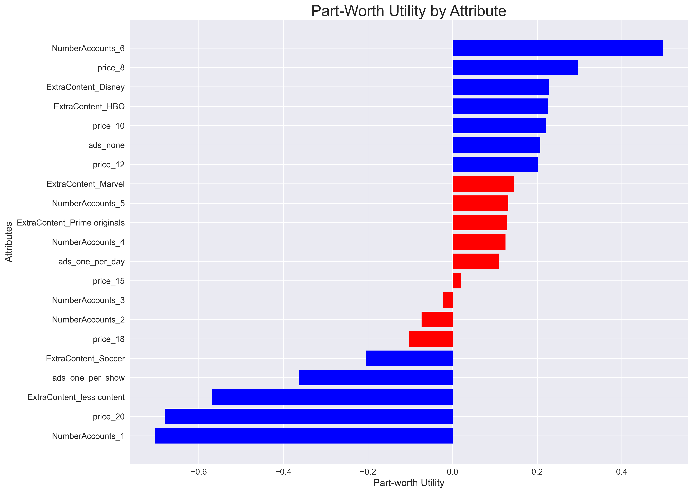
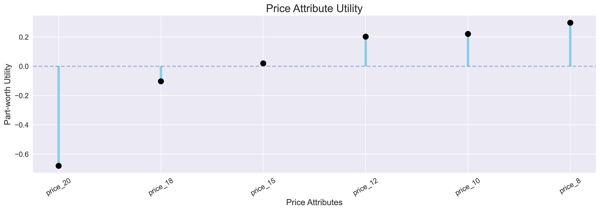
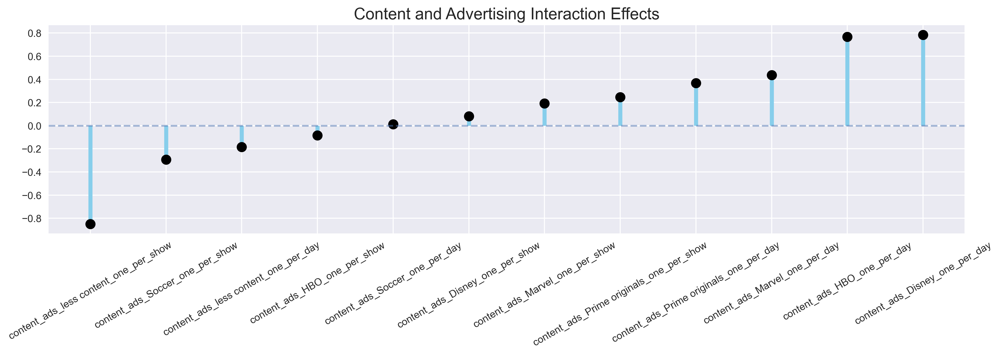

# Netflix Subscription Preference Analysis using Conjoint Analysis & Logistic Regression

This project applies a regression-based conjoint analysis framework to evaluate how different Netflix subscription features influence customer preferences and subscription decisions.

Using simulated customer choice data and logistic regression modeling, the analysis estimates customer utility trade-offs across subscription pricing, account-sharing flexibility, premium content offerings, and advertisement exposure.

The project demonstrates how conjoint-style preference modeling can support subscription design, pricing strategy, and product optimization decisions for streaming platforms.

---

## Executive Summary

This analysis explores how customers evaluate competing Netflix subscription configurations using conjoint-style utility modeling.

The results indicate that:

- Account-sharing flexibility was the strongest driver of customer preference
- Customers showed high sensitivity to premium pricing tiers
- Premium content offerings significantly increased subscription attractiveness
- Customers tolerated advertisements more when stronger content libraries were included

The findings highlight how streaming platforms can balance pricing, advertisements, and premium content investments to optimize subscription strategies.

This type of analysis is commonly used in subscription-based businesses to optimize pricing strategy and product design based on customer preference structures.

---

## 📌 Business Problem

Streaming platforms increasingly rely on balancing:

- Subscription pricing
- Advertisement monetization
- Premium content investment
- Multi-user account access

Understanding how customers trade off these features is critical for improving customer acquisition, retention, and subscription profitability.

This project explores which subscription attributes most strongly influence customer choice behavior.

---

## 🎯 Project Objectives

The analysis aims to:

- Estimate customer part-worth utilities for subscription attributes
- Measure the relative importance of Netflix plan features
- Analyze trade-offs between pricing, content, and advertisements
- Identify combinations that maximize customer preference
- Generate business insights for subscription optimization

---

## 📂 Dataset

The dataset contains simulated customer survey responses representing subscription plan selections across multiple feature combinations.

### Dataset Overview

- 3,000 simulated customer observations
- Binary subscription choice outcome (`selected`)
- Multiple conjoint-style subscription configurations

### Included Attributes

- Number of Accounts
- Subscription Price
- Premium Content Type
- Advertisement Frequency

---

## ⚙️ Methodology

The project follows a conjoint-analysis-inspired workflow:

1. Data preprocessing and categorical encoding
2. Dummy variable creation for subscription attributes
3. Binomial logistic regression (GLM) utility estimation
4. Part-worth utility calculation
5. Relative feature importance analysis
6. Interaction effect modeling between content and advertisements
7. Visualization and interpretation of customer trade-offs

---

## 🛠 Tools & Libraries

- Python
- Pandas
- NumPy
- Statsmodels
- Matplotlib
- Seaborn (for visualization styling)
- Squarify
- Jupyter Notebook

---

## 📊 Key Results

### Relative Feature Importance

| Attribute | Relative Importance |
|---|---|
| Number of Accounts | 33.9% |
| Price | 27.6% |
| Extra Content | 22.5% |
| Advertisement Exposure | 16.1% |

### Key Insight

Account-sharing flexibility had the strongest influence on customer preference, exceeding even pricing sensitivity.

---

## 📈 Utility Findings

### Positive Preference Drivers

Customers showed higher utility for:

- 6-account subscription plans
- Lower-priced tiers ($8–$12)
- HBO and Disney premium content
- No advertisements or limited daily ads

### Negative Preference Drivers

Customers strongly disliked:

- Single-account subscription plans
- High pricing tiers ($20)
- “Less content” configurations
- Advertisements shown every program

---

## 🔄 Interaction Effect Analysis

The interaction modeling revealed that customers were more tolerant of advertisements when stronger premium content offerings were included.

However, aggressive advertisement frequency combined with weak content offerings generated significant negative utility.

This suggests that premium content can partially offset advertisement-related dissatisfaction, but only up to a certain threshold.

---

## 🧠 Business Insights

The analysis suggests several strategic implications for streaming platforms:

- Multi-account flexibility is a major competitive advantage
- Customers are highly price-sensitive at premium price points
- Premium content meaningfully increases subscription attractiveness
- Moderate advertisement exposure may be acceptable when paired with stronger content libraries

### Potential Strategic Opportunities

- Ad-supported premium content tiers
- Family-oriented multi-account subscription bundles
- Hybrid monetization strategies balancing advertisements and content quality

---

## 📷 Visualizations

### Part-worth Utility by Attribute



---

### Price Attribute Utility



---

### Content × Advertisement Interaction Effects



---

## 📁 Project Structure

```text
netflix-conjoint-analysis/
│
├── data/
│   └── netflix_customer_survey.csv
│
├── notebooks/
│   └── 01_conjoint_analysis_glm.ipynb
│
├── visuals/
│   ├── content_ad_interaction_effects.png
│   ├── partworth_utility_by_attribute.png
│   └── price_attribute_utility.png
│
├── src/
│   └── utils.py
│
├── README.md
├── requirements.txt
└── .gitignore
```

---

## 🚀 Setup Instructions

Clone the repository:

```bash
git clone https://github.com/FarazIbrahim/netflix-conjoint-analysis.git
```

Navigate to the project directory:

```bash
cd netflix-conjoint-analysis
```

Install dependencies:

```bash
pip install -r requirements.txt
```

---

## ▶️ Run the Analysis

Launch Jupyter Notebook:

```bash
jupyter notebook notebooks/01_conjoint_analysis_glm.ipynb
```

---

## 📊 How to Interpret Results

Each estimated coefficient is interpreted as a part-worth utility in the conjoint analysis framework, representing how each attribute level influences customer preference.

- Positive values → increase preference
- Negative values → decrease preference
- Larger absolute values → stronger influence on customer choice

---

## ⚠️ Limitations

This project has several limitations:

- The dataset is simulated rather than real customer data
- Results depend on the selected attribute combinations
- The model uses regression-based conjoint estimation rather than advanced hierarchical Bayesian methods
- Customer preferences may evolve over time due to market competition and platform changes

---

## 🔮 Future Improvements

Potential future extensions include:

- Hierarchical Bayesian conjoint modeling
- Customer segmentation and clustering
- Market share simulation
- Willingness-to-pay estimation
- Multinomial choice modeling
- Real-world survey integration

---

## 👤 Author

**Faraz Ibrahim**

Data Science / Marketing Analytics Project

May 2026